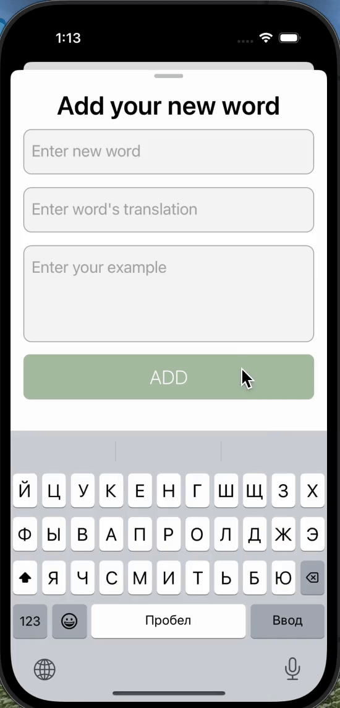
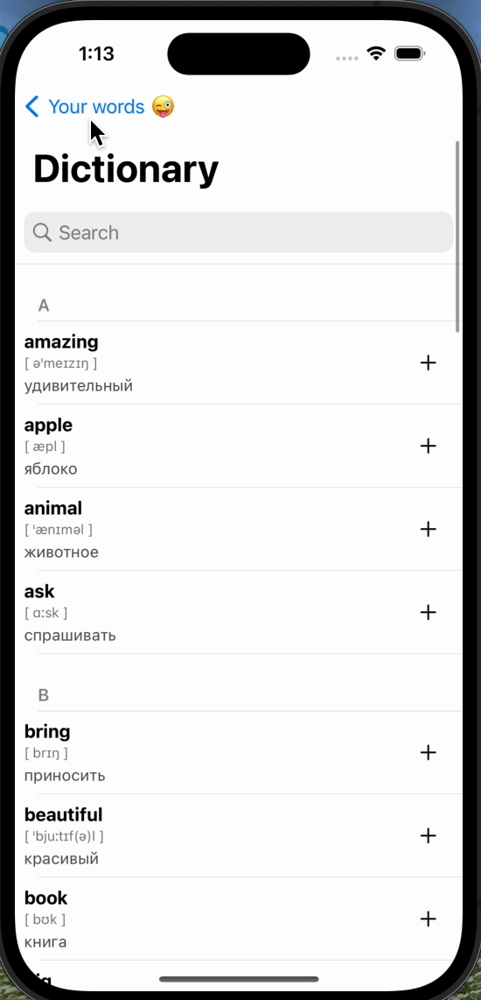
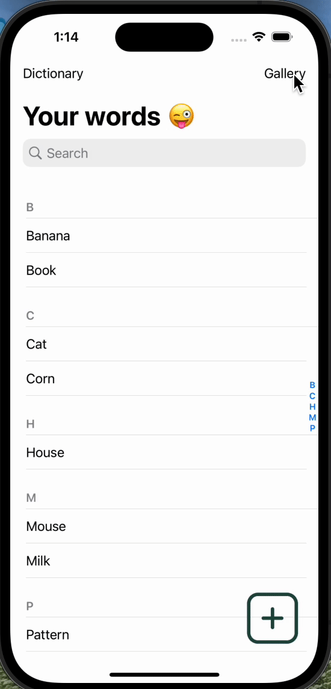

# SmartDictionary
*Данный проект создан в учебных целях*

## Умная записная книжка для изучения слов
+ Для хранения данных используется база данных.
+ Интерфейс приложения реализован через код.
  
### **На данный момент в проекте реализовано:**

  1. Пользовательский словарь с возможностью добавления, изменения и удаления слов.
  
     
     
   
  2. Англо-русский словарь, реализованный с помощью Yandex Dictionary API.

  
    
 3. Поиск слов с моментальным обновлением интерфейса.

  
    
 4. Поиск изображений по слову для упрощённого изучения. Работает на нескольких языках.

  
    
 5. Галерея изображений.
 
    
